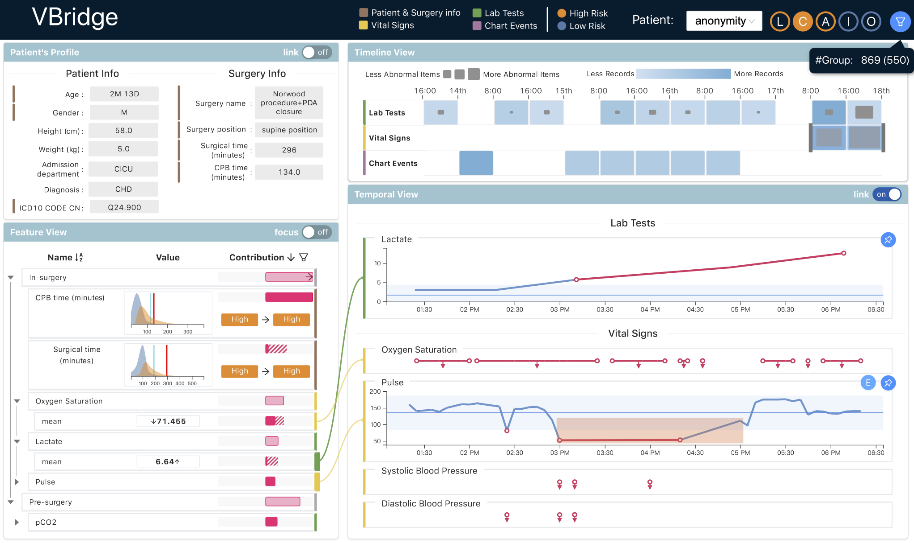

<p align="left">

<i>An open source project from Data to AI Lab at MIT.</i>
</p>

<!-- Uncomment these lines after releasing the package to PyPI for version and downloads badges -->
<!--[](https://pypi.python.org/pypi/vbridge)-->
<!--[](https://pepy.tech/project/vbridge)-->
[](https://github.com/sibyl-dev/VBridge/actions)


# VBridge

VBridge is an interactive visualization system for explaining healthcare models.
This project aims to support users understand machine learning models using
Electronic Health Records (e.g., [MIMIC-III](https://mimic.physionet.org))
as inputs for health predictions.
The system is built upon [Cardea](https://github.com/MLBazaar/Cardea) and a number of AutoML tools developed under [The MLBazaar Project](https://mlbazaar.github.io/) at [Data to AI Lab at MIT](https://dai.lids.mit.edu/).

The related paper, "VBridge: Connecting the Dots Between Features and Data to Explain Healthcare Models,"
has been accepted to TVCG ([IEEE VIS 2021](http://ieeevis.org/year/2021/welcome))
with an **Honorable Mention Award** ([pdf](https://arxiv.org/abs/2108.02550)).



# Quickstart

The `VBridge` project contains three parts: `vbridge-core`, `vbridge-api`, and `vbridge-vis`, where
* `vbridge-core` is a machine learning library built upon [Cardea](https://github.com/MLBazaar/Cardea)
 that supports users to 1) develop machine learning models from Electronic Health Record dataset
 and 2) generate explanations in different levels (see our [paper](https://arxiv.org/abs/2108.02550)).
* `vbridge-api` is a collection of Restful APIs built on the top of `vbridge-core`, that support
 users to retrieve information (data, model, explanation) from a vbridge instance.
* `vbridge-vis` is a [React](https://reactjs.org/) app, an interface that visualizes the information got from `vbridge-api`.

## Install from source
Ensure that [python (>=3.7)](https://www.python.org/) (for `vbridge-core` and `vbridge-api`)
and [node.js](https://nodejs.org/) (for `vbridge-vis`) have been installed.

For using `vbridge-core` and `vbridge-api`, clone the repository and install it from source by running `make install`:

```bash
git clone git@github.com:sibyl-dev/VBridge.git
cd vbridge
make install
```

For using `vbridge-vis`, further run

```bash
cd ../client
npm install
```

## Quickstart
In this short tutorial we will help you get started with VBridge.

Before starting, we first download a sample dataset [mimic-iii-demo](https://physionet.org/content/mimiciii-demo/1.4/) (13.4MB)
by running the following command in the root directory of this project (`VBridge/`).
```bash
wget -r -N -c -np https://physionet.org/files/mimiciii-demo/1.4/ -P data/
```
You can also directly go to the dataset webpage and download the `.zip` file.
Unzip and move it to `VBridge/data/`.
Ensure that the table files (.csv) exist in `data/physionet.org/files/mimiciii-demo/1.4/`.


### How to use `vbridge-core`

<details>
  <summary>A step-by-step example</summary>
    
---
    
**1. Load Task and Initialization**. We then load a predefined task called *mimic_48h_in_admission_mortality*.

```python
from vbridge.core import VBridge
from vbridge.dataset.mimic_demo.tasks.mortality import mimic_48h_in_admission_mortality_task

task = mimic_48h_in_admission_mortality_task()
vbridge = VBridge(task)
```

This task aims to predict the patient's **mortality risk** (i.e., die or survive) during the hospital admission according to the patient's demographics, label tests, and vital signs in the first 48 hours after being admitted.

**2. Load Entity Set**. We load the tables and organize them into an `Entityset`.
```python
vbridge.load_entity_set()
```
In brief, an `Entityset` is a collection of dataframes and the relationships between them. Check [featuretools](https://featuretools.alteryx.com/en/stable/getting_started/using_entitysets.html) for more details.

**3. Generate Features**. Then we use [Deep Feature Synthesis](https://featuretools.alteryx.com/en/stable/getting_started/afe.html)
to generate features.
```python
feature_matrix, feature_list = vbridge.generate_features()
feature_matrix.head()
```
```
        ADMISSION_TYPE         ADMISSION_LOCATION  ...  MEAN(CHARTEVENTS.VALUENUM
                                                             WHERE ITEMID = 220181)
HADM_ID
171878        ELECTIVE  PHYS REFERRAL/NORMAL DELI  ...                          NaN
172454       EMERGENCY       EMERGENCY ROOM ADMIT  ...                    73.046512
167021       EMERGENCY       EMERGENCY ROOM ADMIT  ...                    80.250000
164869       EMERGENCY  CLINIC REFERRAL/PREMATURE  ...                          NaN
158100       EMERGENCY  CLINIC REFERRAL/PREMATURE  ...                    81.916667

```

**4. Train Models**. We train a sample machine learning model (i.e., xgboost) for the mortality prediction task.
```python
vbridge.train_model()
```

**5. Generate Explanations**. At last, we explain the model predictions.
In VBridge, we develop three types of explanations: *feature contributions* (i.e., [SHAP](https://github.com/slundberg/shap) values),
*what-if-analysis*, and *influential records*.
We take feature contributions as an example.
```python
shap_values = vbridge.feature_explain(X=feature_matrix, target='mortality')
```
    
---
    
</details>

You can also check `notebooks/Getting Started.ipynb` for this example.

### How to use `vbridge-api`
Start the VBridge server by
```bash
python vbridge/router/app.py
```

Check `http://localhost:7777/apidocs/` in your browser for the RESTful API documentation.

### How to use `vbridge-vis`
After starting the VBridge server, open another terminal, go to the `VBridge/` folder, and run
```bash
cd client
npm start
```

Then navigate to `http://localhost:3000/` in your browser to see `vbridge-vis`.

# Citations
```
@article{cheng2021vbridge,
  title={VBridge: Connecting the Dots Between Features and Data to Explain Healthcare Models},
  author={Cheng, Furui and Liu, Dongyu and Du, Fan and Lin, Yanna and Zytek, Alexandra and Li, Haomin and Qu, Huamin and Veeramachaneni, Kalyan},
  journal={IEEE Transactions on Visualization and Computer Graphics},
  year={2021},
  publisher={IEEE}
}
